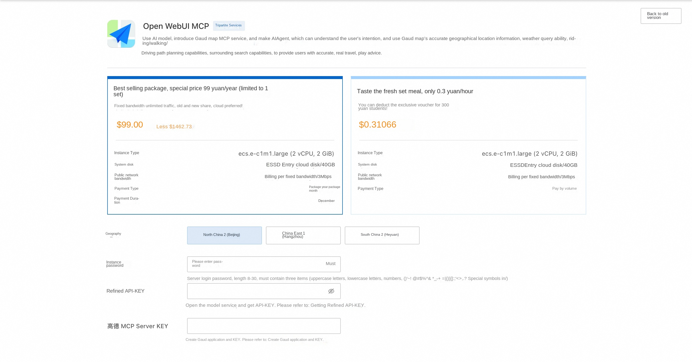
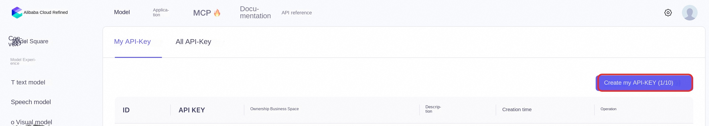
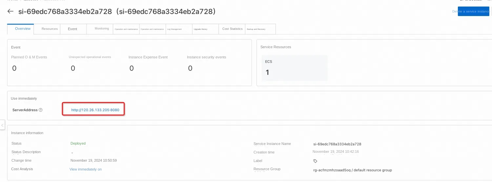
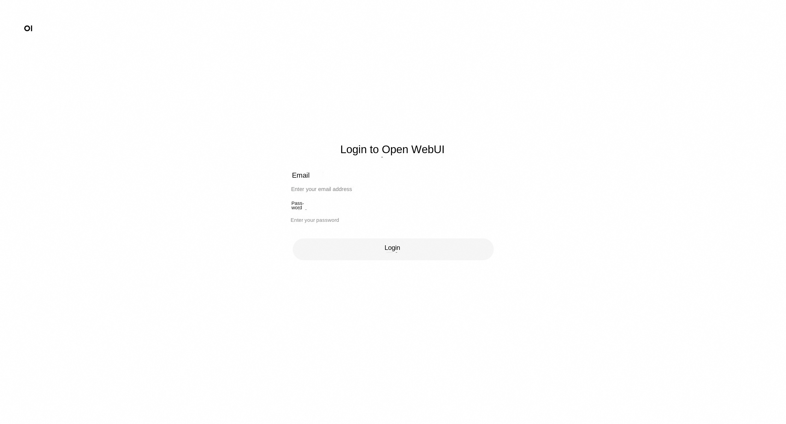
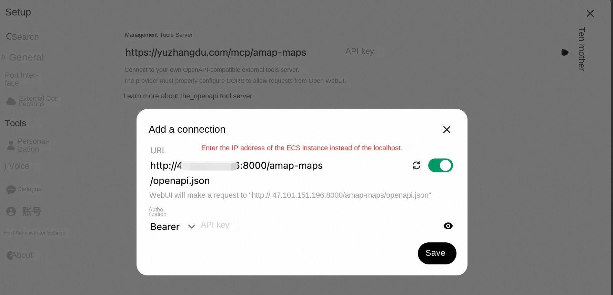
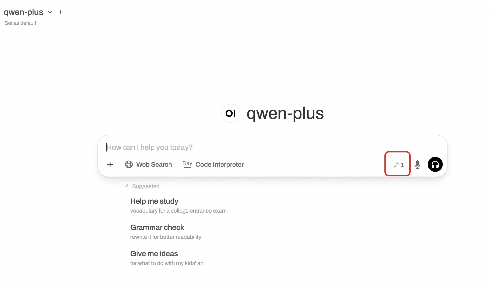
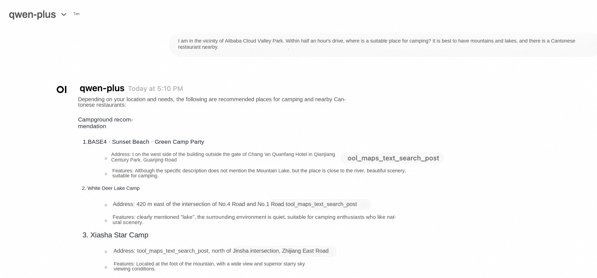

## Introduction to Open WebUI and Refined

Open WebUI is a feature-rich and user-friendly self-hosted web user interface (WebUI) designed to interact with large language models (LLMs), specifically those supported by Ollama or services compatible with the OpenAI API. Open WebUI provides the ability to run completely offline, which means that users can talk to models without an internet connection, which is especially important for data privacy and security-sensitive application scenarios.
Here are some of the key features of Open WebUI:
Intuitive interface: Open WebUI's interface is inspired by ChatGPT, providing a clear and user-friendly chat interface that makes interaction with large language models intuitive.
2. Extensibility: This platform is extensible, meaning that it can be customized and enhanced by adding new plug-ins or features to adapt to different usage scenarios and needs.
3. Offline operation: Open WebUI supports completely offline operation, does not rely on network connection, and is suitable for use on any device, whether on an airplane or in remote areas.
Compatibility: It is compatible with multiple LLM Runners, including Ollama and OpenAI APIs, which allows users to select and run different language models from multiple sources.
Self-hosted: Users can deploy Open WebUI on their own servers or devices, which provides greater protection for data privacy and control.
Markdown and LaTeX support: Open WebUI provides comprehensive Markdown and LaTeX functionality that allows users to generate rich text output, which is useful in scientific and academic communication.
Local RAG integration: The Retrieval Enhanced Generation (RAG) feature allows the model to leverage locally stored data for more in-depth and specific responses, enhancing chat interactions.
Tongyi Bailian is an advanced multi-modal pre-training model launched by Alibaba Cloud. It combines natural language processing (NLP) and computer vision (CV) techniques to understand and generate many types of data, such as text, images, and video. The design goal of Tongyi Bailian is to provide developers and enterprises with a powerful tool for more efficient and intelligent data processing and analysis in various application scenarios.

## Introduction to Gaud MCP Server
In order to realize better interaction between LBS service and LLM, Gaud Map MCP Server now covers 12 core service interfaces and provides map services covering all scenes, including geocoding, inverse geocoding, IP positioning, weather query, cycling path planning, walking path planning, driving path planning, bus path planning, distance measurement, keyword search, peripheral search, detail search, etc. In order to further improve the access efficiency and experience of developers, Gaud Map Open Platform provides developers with a general-level SSE protocol MCP service solution.

## Billing Description
The cost of the Open Web UI panel on Alibaba Cloud is mainly related:
* Specifications of the selected GPU cloud server
* Disk Capacity
* Internet Bandwidth

Billing method: pay by volume (hour) or package year and month
The estimated cost can be seen in real time when the instance is created.

Refined model call cost:
* When you first open the Hundred Refinement, the platform will automatically issue you the exclusive free quota for newcomers of each model. For details, please refer to [Hundred Refinement Newcomer Free Quota](https://help.aliyun.com/zh/model-studio/new-free-quota?spm=a2c4g.11186623.help-menu-2400256.d_4_1.6dea55efFQCijR#view-quota).

## Permissions required for RAM accounts

| Permission policy name | Comment |
| ------------------------------------- | -------------------- |
| AliyunECSFullAccess | Permissions to manage ECS instances |
| AliyunVPCFullAccess | Permissions to manage a VPC |
| AliyunROSFullAccess | Manage permissions for Resource Orchestration Service (ROS) |
| AliyunComputeNestUserFullAccess | Manage user-side permissions for the compute nest service (ComputeNest) |

## Deployment Services

1. Click [Deployment Link](https://computenest.console.aliyun.com/service/palworld/deploy?ServiceId=service-c0552c20597a4c62b168) to enter the service instance deployment interface, and fill in the parameters according to the interface prompt.

2. The deployment parameters need to be refined API-KEY,* * [Log in to refined console](https://bailian.console.aliyun.com/?spm = 5176.24779694.0.0.27304 d22k6ajsz & tab = model#/api-key)* *, click * * Create My API-KEY * *, and copy it for later use. API-KEY is personal confidential information, do not disclose. If Bailian has not been opened, please click [Open Bailian Model Service](https://help.aliyun.com/zh/model-studio/getting-started/first-api-call-to-qwen?spm=a2c4g.11186623.help-menu-2400256.d_0_1_0.5a06b0a8lg5WY2#5058e161041ps) to complete the opening.

Get Gaud Map API KEY: Enter [Gaud Open Platform](https://lbs.amap.com/), register and get Gaud API KEY for standby. Gaud offered a free quota.

3. After confirming the order is completed, click **Create Now**.
4. After the deployment is completed, you can start using the service. Enter the service instance details and click Address to access.

5. Register an account and log in to the service.

## set on the front end of open webui
1. Click "Settings" and click "Tools".
2. If you are using the public IP address of ECS, when filling in the address of the tool, you should fill in http:// your ECS IP address: 8000/amap-maps (for example, if your IP address is 12.123.123.123, you should fill in http:// 12.123.123.123:8000/amap-maps) instead of localhost

3. If you set up to use the domain name to access your open webui website. For example, if you use https://example.com to access your Open WebUI website, you need to make changes to your nginx configuration file (in/etc/nginx/sites-available this directory). In the nginx configuration file, add the following content.

'''text
# Proxy settings for MCP server
location /mcp/ {
proxy_pass http://localhost:8000 /;
proxy_set_header Host $host;
proxy_set_header X-Real-IP $remote_addr;
proxy_set_header X-Forwarded-For $proxy_add_x_forwarded_for;
proxy_set_header X-Forwarded-Proto $scheme;

proxy_http_version 1.1;
proxy_set_header Upgrade $http_upgrade;
proxy_set_header Connection "upgrade ";
}
'''

The complete configuration file is below. Note: Please replace example.com in the following file with your own domain name.
'''text
server {
listen 443 ssl;
server_name example.com www.example.com;

# SSL Configuration
ssl_certificate /etc/nginx/ssl/example.com.pem;
ssl_certificate_key /etc/nginx/ssl/example.com.key;

# Security headers (optional but recommended)
add_header Strict-Transport-Security "max-age=31536000" always;
add_header X-Content-Type-Options nosniff;
add_header X-Frame-Options "SAMEORIGIN ";
add_header X-XSS-Protection "1; mode=block ";

# Proxy settings
location / {
proxy_pass http://localhost:8080; # Your service running on port 3000
proxy_set_header Host $host;
proxy_set_header X-Real-IP $remote_addr;
proxy_set_header X-Forwarded-For $proxy_add_x_forwarded_for;
proxy_set_header X-Forwarded-Proto $scheme;

# WebSocket support (if needed)
proxy_http_version 1.1;
proxy_set_header Upgrade $http_upgrade;
proxy_set_header Connection "upgrade ";
}

# Proxy settings for MCP server
location /mcp/ {
proxy_pass http://localhost:8000 /;
proxy_set_header Host $host;
proxy_set_header X-Real-IP $remote_addr;
proxy_set_header X-Forwarded-For $proxy_add_x_forwarded_for;
proxy_set_header X-Forwarded-Proto $scheme;

proxy_http_version 1.1;
proxy_set_header Upgrade $http_upgrade;
proxy_set_header Connection "upgrade ";
}
}
'''

4. Save the nginx configuration file. Restart nginx.
'''Shell
sudo nginx -t # Test the configuration
sudo systemctl restart nginx
'''

5. In the Open WebUI front end, configure as follows. The symbol for the tool appears on the page, and the model suggests the qwen-plus.

6. It can be found that when talking with AI, the MCP service of Gaud Map is called.

